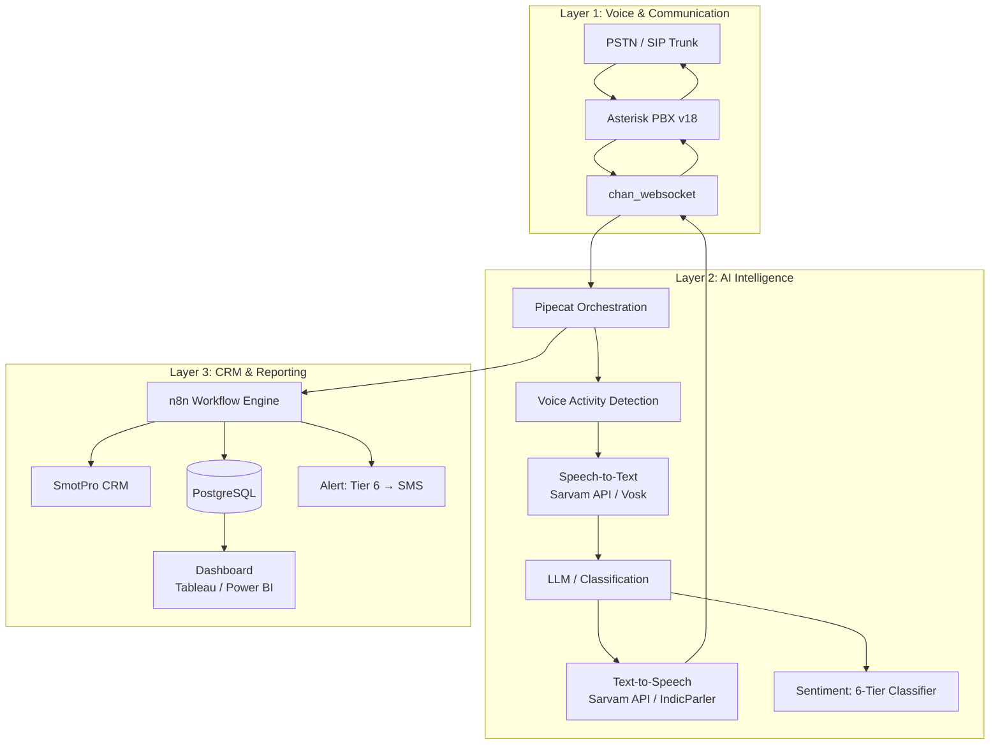
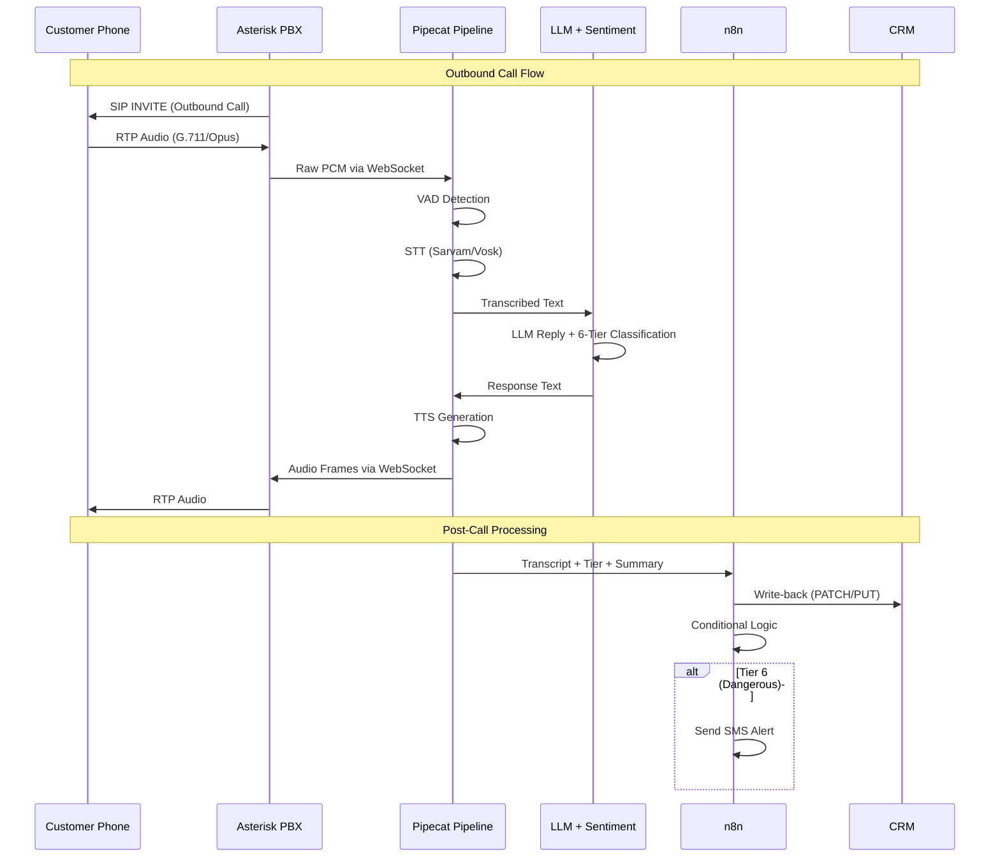
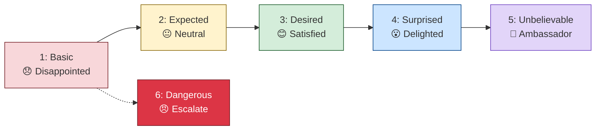
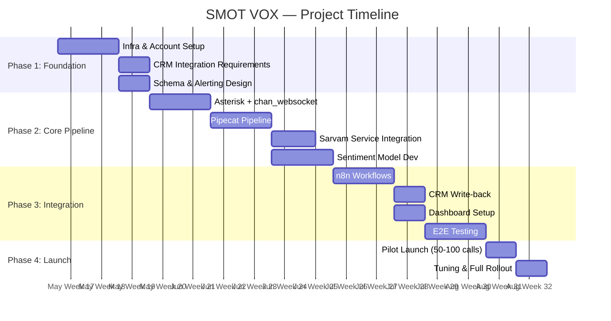

# 🎙️ SMOT VOX — AI Customer Experience Manager

> **Outbound & Inbound Voice AI** that calls customers post-trip, analyzes sentiment in real-time across 6 experience tiers, and auto-updates CRM — all on a low-latency Asterisk + Pipecat pipeline.

---

## 📋 Table of Contents

- [Architecture Overview](#-architecture-overview)
- [Call Flow (How It Works)](#-call-flow-how-it-works)
- [6 Experience Tiers](#-6-experience-tiers)
- [Tech Stack](#-tech-stack)
- [Project Roadmap](#-project-roadmap)
- [Team Structure](#-team-structure)
- [Setup & Development](#-setup--development)
- [Repository Structure](#-repository-structure)

---

## 🏗️ Architecture Overview



### Three-Layer Design

| Layer | Purpose | Components |
|-------|---------|-----------|
| **Voice & Communication** | Handle real calls over SIP/PSTN | Asterisk v18, chan_websocket, SIP Trunk |
| **AI Intelligence** | Real-time STT → LLM → TTS + Sentiment | Pipecat, Sarvam API, Vosk, Custom Sentiment Model |
| **CRM & Reporting** | Post-call processing, storage, dashboards | n8n, SmotPro CRM, PostgreSQL, Tableau/Power BI |

---

## 📞 Call Flow (How It Works)



---

## 🎯 6 Experience Tiers



| Tier | Label | Description | AI Detects |
|------|-------|-------------|------------|
| 1 | Basic 😞 | Experience was not good. Won't return/refer. | "disappointed", clipped answers, low energy |
| 2 | Expected 😐 | Met expectations. Neutral. Replaceable. | "it was fine", flat factual tone |
| 3 | Desired 😊 | Delivered unstated wish. Loyalty building. | "just what I wanted", warm tone |
| 4 | Surprised 😮 | Got more than expected. Genuine delight. | "I didn't expect that!", enthusiasm |
| 5 | Unbelievable 🤩 | Way beyond. Brand ambassador. | "best ever", superlatives, storytelling |
| 6 | Dangerous 😠 | Upset. High churn & review risk. Immediate action. | raised voice, "never again", refund threats |

---

## 🛠️ Tech Stack

| Category | Technology | Purpose |
|----------|-----------|---------|
| **Media Layer** | Asterisk v18 / FreeSWITCH | SIP, RTP, codec negotiation |
| **Audio Bridge** | chan_websocket | Bidirectional PCM streaming to Pipecat |
| **Orchestration** | Pipecat | Real-time pipeline: VAD → STT → LLM → TTS |
| **STT** | Sarvam API / Vosk | Speech-to-Text (Hindi + English) |
| **LLM** | Sarvam / Local | Reply generation + classification |
| **TTS** | Sarvam API / IndicParler TTS | Text-to-Speech |
| **Sentiment** | Custom (muril-base-cased) | Code-mixed Hinglish sentiment |
| **Workflow** | n8n (self-hosted) | Post-call processing, CRM write-back, alerts |
| **Database** | PostgreSQL | Call logs, transcripts, insights |
| **Dashboard** | Tableau / Power BI | Reporting & analytics |
| **Infra (Cloud)** | AWS EC2 g5.xlarge | Model fine-tuning |

---

## 🗺️ Project Roadmap



| Phase | Duration | Deliverables |
|-------|----------|-------------|
| **1: Discovery & Design** | Weeks 1–2 | Infrastructure, CRM audit, tier calibration |
| **2: Core Pipeline** | Weeks 3–7 | Asterisk bridge, Pipecat, STT/TTS, Sentiment |
| **3: Integration & QA** | Weeks 8–11 | n8n, CRM write-back, dashboard, E2E tests |
| **4: Pilot Launch** | Week 12 | 50–100 real customers, tuning, full rollout |

---

## 👥 Team Structure

| Team | Members | Role |
|------|---------|------|
| **AI Engineers** | Aswin, Bharat Ram | Pipeline dev, Pipecat, models |
| **SRV Infotech** | Rezin | CRM APIs, infrastructure |
| **SmotPro** | Ranjith, Murali | Product, SIP trunk evaluation |
| **Coordinator** | Mani | Tool evaluation, timeline tracking |

---

## 🚀 Setup & Development

### Prerequisites

- Python 3.10+
- Asterisk v18+
- Node.js 18+ (for n8n)
- PostgreSQL 15+
- Sarvam API key
- SIP trunk provider credentials

### Quick Start

```bash
# Clone the repository
git clone https://github.com/Manibharadwaj/SMOT-VOX.git
cd SMOT-VOX

# Set up Python environment
python -m venv venv
source venv/bin/activate
pip install -r requirements.txt

# Configure environment
cp .env.example .env
# Edit .env with your API keys and credentials

# Start development
# See docs/ for detailed setup guides
```

### Local Dev Environment

| Component | Min Spec | Recommended |
|-----------|----------|-------------|
| CPU | i7-10700K / Ryzen 7 | Mac Mini M series |
| RAM | 16 GB | 32 GB |
| Storage | 500 GB NVMe | 1 TB SSD |
| Cloud GPU | — | AWS g5.xlarge (~$1/hr) |

---

## 📁 Repository Structure

```
SMOT-VOX/
├── README.md
├── docs/
│   ├── architecture.md
│   ├── setup.md
│   ├── api-reference.md
│   └── sentiment-model.md
├── asterisk/
│   ├── extensions.conf
│   ├── sip.conf
│   └── audio-socket-config/
├── pipecat/
│   ├── pipeline.py
│   ├── services/
│   │   ├── sarvaam_sst.py
│   │   ├── sarvaam_tts.py
│   │   └── sentiment_classifier.py
│   └── config.py
├── n8n/
│   └── workflows/
├── sentiment/
│   ├── training/
│   └── model/
├── db/
│   └── schema.sql
├── scripts/
│   └── deploy.sh
├── requirements.txt
├── .env.example
└── .gitignore
```

---

<div align="center">
    <b>SMOT VOX</b> — Building the future of customer experience, one call at a time.
</div>
